# Markdown教程
[markdwon基础教程](https://www.jianshu.com/p/ed47397774c4)
## 标题
使用 # 号可表示1~6级标题
 
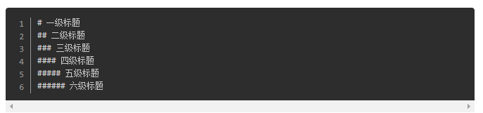
 

# 一级标题
## 二级标题
### 三级标题
#### 四级标题
##### 五级标题
###### 六级标题

## 段落样式

### 字体
可以使用斜体/粗体和粗斜体三种字体，使用*或_包裹
 
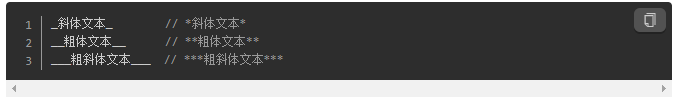
 
_斜体文本_        // *斜体文本* 
 
__粗体文本__      // **粗体文本**
 
___粗斜体文本___  // ***粗斜体文本***

 ### 分割线
 使用三个或以上的*、-、_来建立分割线，其中可以插入空格 
  
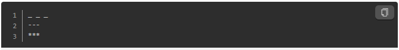
  
 _ _ _
---
***

### 下划线和删除线
文字两端加上<u>标签是下划线，加上两个波浪线~~则是删除线
 
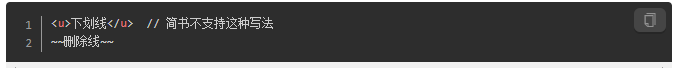
 
<u>下划线</u>  // 简书不支持这种写法
 
~~删除线~~

### 脚注
使用[^A]
 
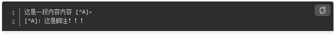

### 列表
Markdown支持有序列表和无序列表两种形式
 
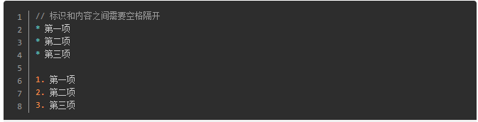
 
无序列表使用 * 或 + 或 - 标识
 
有序列表使用 数字 加 . 标识
 
* 第一项
* 第二项
* 第三项

1. 第一项
2. 第二项
3. 第三项

### 区块引用
区块引用是在锻炼开头使用>符号
 
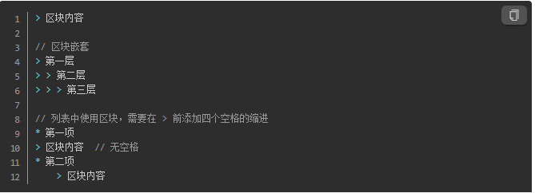
 
> 区块内容

> 第一层
> > 第二层
> > > 第三层

* 第一项
> 区块内容  
* 第二项 
    > 区块内容

### 代码
段落上的一个函数或片段可以用两个反引号`把它包起来，代码区块使用4个空格或者上下三个反引号包裹起来
 
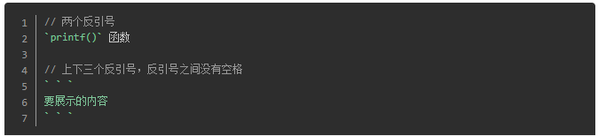
 

`printf()` 函数
 
` ` `
console.log()
` ` `

### 链接或图片
插入链接和图片比较简单，使用方法如下.
 
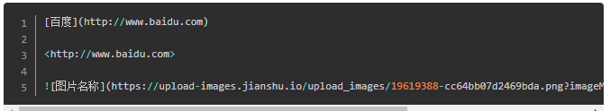
###### 注：通过img标签可以调节图片高度与宽度，但简书不支持这种方式
[百度](http://www.baidu.com)
<http://www.baidu.com>
##### 插入本地图片

## 高级技巧

### HTML标签
不在Markdown涵盖之内的标签，都可以直接在文档里面用HTML撰写
 
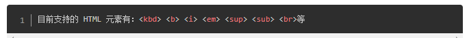

### 转义
Markdown 使用了很多特殊符号来表示特定的意义，如果需要显示特定的符号则需要使用转义字符 \
 
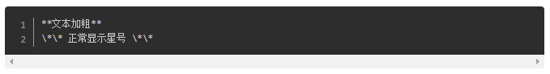
 
**文本加粗** 
 
\*\* 正常显示星号 \*\*

### 文字上色
Markdown 并不支持文字颜色改变，目前可以采取折中的方法，将编辑完成的文档导出为html，然后在需要上色的部分手动添加标签11
 
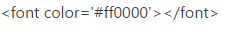