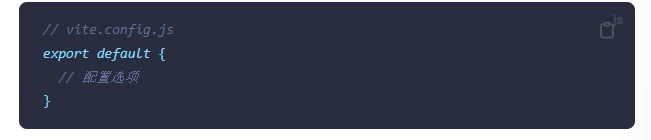
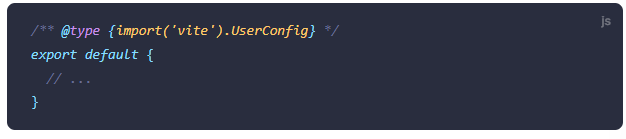
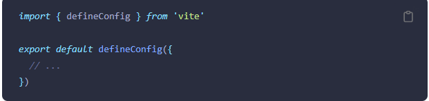
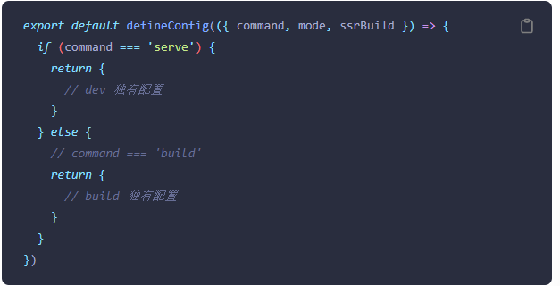
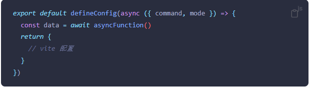
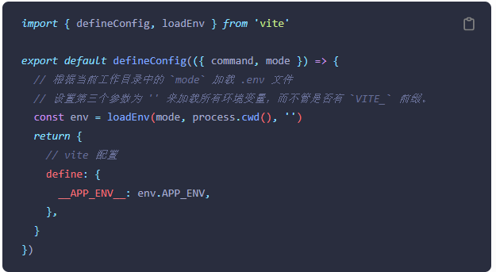

### 配置Vite
[配置vite](https://cn.vitejs.dev/config/)
 
当以命令行方式运行vite时，Vite会自动解析项目根目录下名为vite.config.js的文件
 
最基础的配置文件是这样的
 

 
注意：即使项目没有在package.json中开启type:module,Vite也支持在配置文件中使用ESM语法。这种情况下，配置文件会在被加载前自动进行预处理。
 
你可以显示地通过--config命令行选项指定一个配置文件(相对于cwd路径进行解析)
 
**vite --config my-config.js**
### 配置智能提示
因为Vite本身附带TypeScript类型，所以你可以通过IDE和jsdoc的配合来实现智能提示: 

 
另外你可以使用defineConfig工具函数，这样不用jsdoc注解也可以获取类型提示： 

 
Vite也直接支持TS配置文件。你可以在vite.config.ts中使用defineConfig工具函数
### 情景配置
如果配置文件需要基于(dev /serve或build)命令或者不同的模式来决定选项，亦或者是一个SSR构建(ssrBuild)，则可以选择导出这样一个函数： 

 
需要注意的是，在Vite的API下，在开发环境下command的值为serve(在CLI中，vite dev和vite serve是vite的别名)，而在生产环境下为build(vite build)
 
ssrBuild 仍是实验性的。它只在构建过程中可用，而不是一个更通用的 ssr 标志，因为在开发过程中，我们唯一的服务器会共享处理 SSR 和非 SSR 请求的配置。某些工具可能没有区分浏览器和 SSR 两种构建目标的命令，那么这个值可能是 undefined，因此需要采用显式的比较表达式。
### 异步配置
如果配置需要调用一个异步函数，也可以转而导出一个异步函数： 

### 环境变量
环境变量通常可以从process.env获得
 
vite内置dotenv库会自动解析.env文件
 
注意Vite默认是不加载.env文件的，因为这些文件需要在执行完Vite配置后才能确认加载哪一个，举个例子，root和envDir选项会影响加载行为。不过当你的确需要时，你可以使用Vite导出的loadEnv函数来加载指定的.env文件 

process.cwd()返回当前node进程的工作目录

客户端vite会将环境变量注入到import.meta.env中（环境变量在命名时需要以VITE开头）

