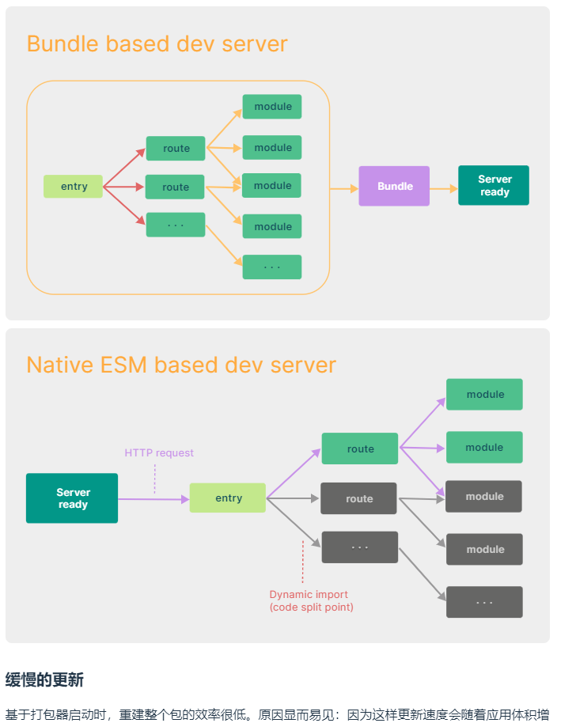

# vite介绍
[为什么选vite](https://cn.vitejs.dev/guide/why.html)
### 为什么选vite
#### 现实问题
在浏览器支持ES模块之前，JavaScript并没有提供原生机制让开发者以模块化的方式进行开发。这也正是我们对'打包'这个概念熟悉的原因：使用工具抓取、处理并将我们的源码模块串联成可以在浏览器中运行的文件。
 
时过境迁，我们见证了诸如webpack、Rolluo和Parcel等工具的变迁。它们极大地改善了前端开发者1的开发体验。
 
然而，当我们开始构建越来越大的应用时，需要处理的JavaScript代码量也呈指数级增长。包含数千个模块的大型项目相当普遍。基于JavaScript开发的工具就会开始遇到性能瓶颈：通常需要很长时间才能启动服务器，即使使用模块热替换（HMR）,文件修改后的效果也需要几秒钟才能在浏览器中反映出院了。如此循环往复，迟钝的反馈会极大地影响开发者的开发效率和幸福感
 
Vite旨在利用生态系统中的新进展解决上述问题：浏览器开始原生支持ES模块，且越来越多JavaScrupt工具使用编译型语言编写。
#### 缓慢的服务器启动
当冷启动开发服务器时，基于打包器的方式启动必须优先抓取并构建你的整个应用，然后才能提供服务。
 
Vite通过在一开始将应用中的模块分为**依赖**和**源码**两类，改进了开发服务器启动时间
* **依赖** 大多为在开发时不会变动的纯 JavaScript。一些较大的依赖（例如有上百个模块的组件库）处理的代价也很高。依赖也通常会存在多种模块化格式（例如 ESM 或者 CommonJS）。
 
Vite 将会使用 esbuild 预构建依赖。esbuild 使用 Go 编写，并且比以 JavaScript 编写的打包器预构建依赖快 10-100 倍。
* **源码** 通常包含一些并非直接是 JavaScript 的文件，需要转换（例如 JSX，CSS 或者 Vue/Svelte 组件），时常会被编辑。同时，并不是所有的源码都需要同时被加载（例如基于路由拆分的代码模块）。
 
Vite 以 原生 ESM 方式提供源码。这实际上是让浏览器接管了打包程序的部分工作：Vite 只需要在浏览器请求源码时进行转换并按需提供源码。根据情景动态导入代码，即只在当前屏幕上实际使用时才会被处理。
 

 
**简单可以理解为例如webpack等传统的构建工具采用的逻辑是需要先将所需要打包的代码文件全部打包之后服务器才能启动成功，这样就导致当文件过大时打包时间就会变长。Vite则是按需打包不需要将所以文件打包之后在启动服务器，这就加快了服务器启动成功**

#### 依赖预购建
1. 在处理引入文件时例如import _ from 'lodash' vite看到了非绝对路径或相对路径的引用，vite则会尝试开启路径不全
    >找寻依赖的过程是自当前目录依次向上查找，直到搜寻到目录或者搜寻到对应依赖为止
    >依赖预购建是在开发阶段做的，生产阶段vite会全权交给rollup库去完成生产环境的打包
2. 有些包是以commonjs规范导出
    >依赖预购建:首先vite会找到对应依赖，然后调用esbuild(对js语法进行处理的一个库)，将其规范的代码转换成esmodule规范，然后放到当前目录下的node_modulee/.vite/deps下
    
    >依赖预购建解决了3个问题：1.不同的第三方包会有不同的导出格式，2.对路径的处理可以直接使用/deps下的文件，方便路径重写，3.网络多包传输的性能问题(引入嵌套引入，也是原生esmodule规范不敢支持node_modules的原因之一)vite会对esmodule规范的各个模块进行集成