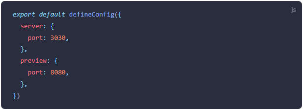

### 预览选项
[预览选项](https://cn.vitejs.dev/config/preview-options.html)

***

#### preview.host
* **类型：** string | boolean
* **默认：** server.host

为开发服务器指定ip地址。设置为0.0.0.0或true会监听所有地址，包括局域网和公共地址
还可以通过CLI进行设置，使用--host 0.0.0.0或--host

***

#### preview.port
* **类型：** number
* **默认：** 4173

指定开发服务器端口。注意如果设置的端口已被使用，Vite将自动尝试下一个可用端口，所以这可能不是最终监听的服务器端口

示例：

***

#### preview.stricPort
* **类型：** boolean
* **默认：** server.strictPort

设置为true时，如果端口已被使用则直接退出，而不会再进行后续端口的尝试

***

#### preview.https
* **类型：** boolean | https.ServerOptions
* **默认：** server.https

启用TLS+HTTP/2.注意，只有在与serve.proxy选项同时使用时，才会降级为TLS

该值也可以传递给https.createServer()的options对象

***

#### preview.open
* **类型：** booleab | string
* **默认：** server.open

开发服务器启动时，自动在浏览器中打开应用程序。当该值为字符串时，它将被用作 URL 的路径名。如果你想在你喜欢的某个浏览器打开该开发服务器，你可以设置环境变量 process.env.BROWSER （例如 firefox）

***

#### preview.proxy
* **类型：** Record<string, string | ProxyOptions>
* **默认：** server.proxy

为开发服务器配置自定义代理规则。其值的结构为 { key: options } 的对象。如果 key 以 ^ 开头，它将被识别为 RegExp，其中 configure 选项可用于访问代理实例

***

#### preview.cors
* **类型：** boolean | CorsOptions
* **默认：** server.cors

为开发服务器配置CORS。此功能默认启用并支持任何来源。可传递一个options对象来进行配置，或者传递false来禁用此行为

***

#### preview.headers
* **类型：** OutgoingHttpHeaders

指明服务器返回的响应头
