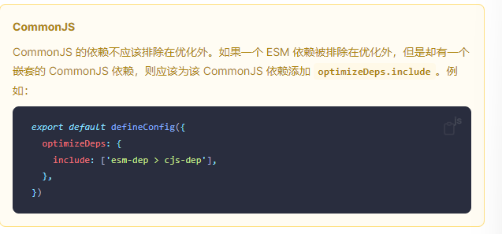

### 依赖优化选项
* **相关内容：**[依赖预购建](https://cn.vitejs.dev/guide/dep-pre-bundling.html)

[依赖优化选项](https://cn.vitejs.dev/config/dep-optimization-options.html)

***

#### optimizeDeps.entries
* **类型：** string | string[]

默认情况下，Vite 会抓取你的 index.html 来检测需要预构建的依赖项（忽略了node_modules、build.outDir、__tests__ 和 coverage）。如果指定了 build.rollupOptions.input，Vite 将转而去抓取这些入口点。

如果这两者都不合你意，则可以使用此选项指定自定义条目——该值需要遵循 fast-glob 模式 ，或者是相对于 Vite 项目根目录的匹配模式数组。当显式声明了 optimizeDeps.entries 时默认只有 node_modules 和 build.outDir 文件夹会被忽略。如果还需忽略其他文件夹，你可以在模式列表中使用以 ! 为前缀的、用来匹配忽略项的模式。

***

#### optimizeDeps.exclude
* **类型：** string[]

在预购建中强制排除的依赖项(遇到数组中包含的依赖则不对其进行依赖预购建)

***

#### optimizeDeps.include
* **类型：** string[]

默认情况下，不在node_modules中的，链接的包不会被预购建。使用此选项可强制预购建链接的包

***

#### optimizeDeps.esbuildOptions
* **类型：** EsbuildBuildOptions

在部署扫描和优化过程中传递给esbuild的选项

某些选项进行了忽略，因为修改它们与vite的优化方案并不兼容

* 忽略了external选项，请使用Vite的optimizeDeps.exclude选项
* plugins与Vite的dep的插件合并

***

#### optimizeDeps.force
* **类型：** boolean

设置为true时可用强制预购建，而忽略之前已经缓存过的、已经优化过的依赖

