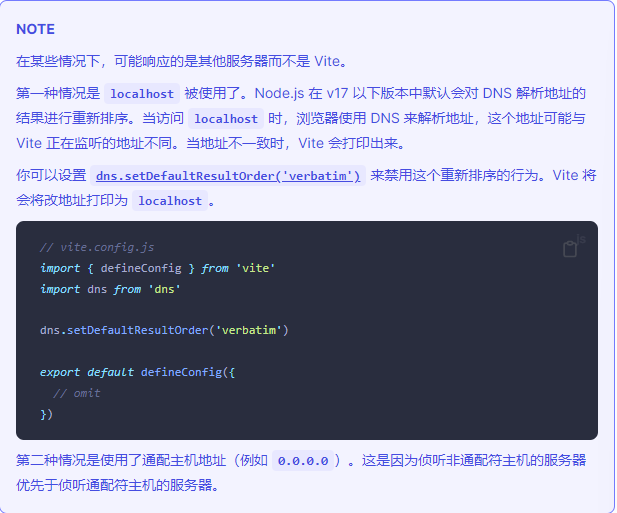
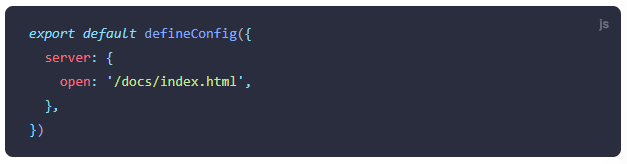
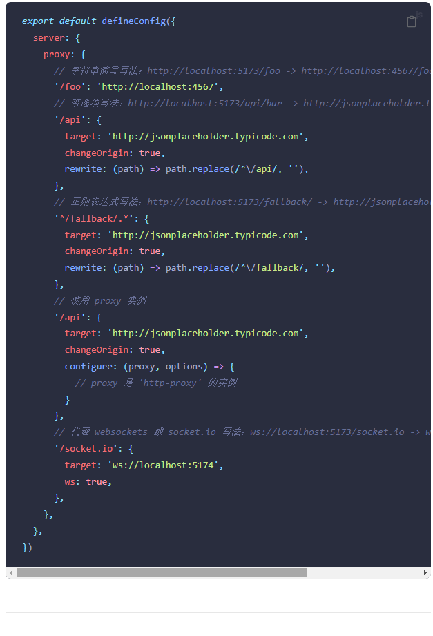
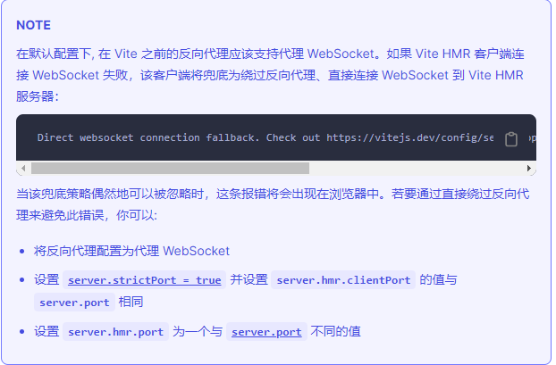
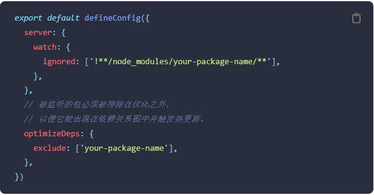
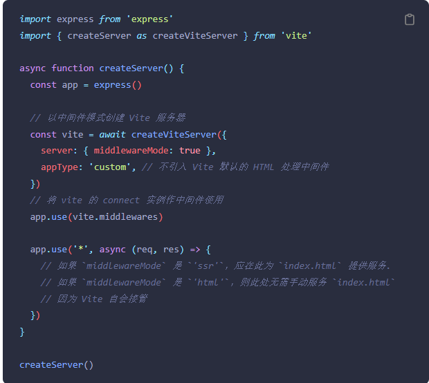
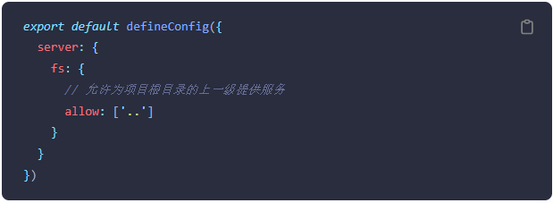
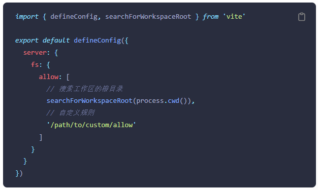
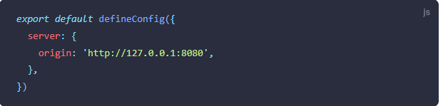

### 开发服务器选项
[开发服务器选项](https://cn.vitejs.dev/config/server-options.html#server-host)

***

#### serve.host
* **类型：** string | boolean
* **默认：** 'localhost'
指定服务器应该监听哪个IP地址。如果将此设置为0.0.0.0或者true将监听所有地址，包括局域网或公网地址
 
也可以通过CLI使用--host 0.0.0.0或--host来设置
 

***

#### server.port
* **类型：** number
* **默认值：** 5173
指定开发服务器端口。注意：如果端口已经被使用，Vite会自动尝试下一个可用的端口，所以这可能不是开发服务器最终监听的实际端口

***

#### server.strictPort
* **类型：** boolean
设为true时若端口已被占用则会直接退出，而不是尝试下一个可用端口

***

#### server.https
* **类型：** boolean | https.ServerOptions
启用TLS + HTTP/2.注意：当serve.proxy选项也被使用时，将会仅使用TLS.

这个值也可以是一个传递给https.createServe()的选项对象

需要一个合法可用的证书。对基本使用的配置需求来说，你可以添加@vitejs/plugin-basic-ssl到项目插件中，它会自动创建和缓存一个自签名的证书。但我们推荐你创建和使用你自己的证书

***

#### serve.open
* **类型：** boolean | string
在开发服务器启动时自动在浏览器中打开应用程序。当此值为字符串时，会被用作URL的路径名，若你想指定喜欢的浏览器打开服务器，你可以设置环境变量process.env.BROWSER

 

**实例：**
 

***

#### server.proxy
* **类型：** Record<string, string | ProxyOptions>  

为开发服务器配置自定义代理规则。期望接收一个 { key: options } 对象。任何请求路径以 key 值开头的请求将被代理到对应的目标。如果 key 值以 ^ 开头，将被识别为 RegExp。configure 选项可用于访问 proxy 实例。

请注意，如果使用了非相对的 基础路径 base，则必须在每个 key 值前加上该 base。

使用 http-proxy。完整选项详见 此处.

在某些情况下，你可能也想要配置底层的开发服务器。（例如添加自定义的中间件到内部的 connect 应用中）为了实现这一点，你需要编写你自己的 插件 并使用 configureServer 函数。

**示例：**
 

***

#### server.cors
* **类型：** boolean | CorsOptins
为开发服务器配置CORS.默认启用并允许任何源，传递一个选项对象来调整行为或设为false表示禁用

*** 

#### server.headers
* **类型：** OutgoingHttpHeaders
指定服务器响应的header

***

#### server.hmr
* **类型：** boolean | { protocol?: string, host?: string, port?: number, path?: string, timeout?: number, overlay?: boolean, clientPort?: number, server?: Server }

禁用或配置 HMR 连接（用于 HMR websocket 必须使用不同的 http 服务器地址的情况）。

设置 server.hmr.overlay 为 false 可以禁用开发服务器错误的屏蔽。

clientPort 是一个高级选项，只在客户端的情况下覆盖端口，这允许你为 websocket 提供不同的端口，而并非在客户端代码中查找。如果需要在 dev-server 情况下使用 SSL 代理，这非常有用。

当 server.hmr.server 被定义后，Vite 将会通过所提供的的服务器来处理 HMR 连接。如果不是在中间件模式下，Vite 将尝试通过已有服务器处理 HMR 连接。这在使用自签证书或想通过网络在某端口暴露 Vite 的情况下，非常有用

*** 

#### server.watch
* **类型：** object

传递给chokidar的文件系统监听器选项

Vite服务器默认会忽略对.git/和node_modules目录的监听。如果你需要对象node_modules/内的包进行监听，你可以为serve.watch.ignored赋值一个取反的glob模式，例如：

***

#### server.middlewareMode
* **类型：** 'ssr' | 'html'

以中间件模式创建vite服务器。(不含HTTP服务器)

* 'ssr' 将禁用 Vite 自身的 HTML 服务逻辑，因此你应该手动为 index.html 提供服务。

* 'html' 将启用 Vite 自身的 HTML 服务逻辑。

* 相关： SSR - 设置开发服务器

* 示例

***

#### server.base
* **类型：** string | undefined
在HTTP请求中预留此文件夹，用于代理Vite作为子文件夹时使用。应该以/字符开始

***

#### server.fs.strict
* **类型：** boolean
* **默认：** true(自Vite2.7起默认启用)

限制为工作区root路径以外的文件的访问

***

#### server.fs.allow
* **类型：** string[]

限制哪些文件可以通过 /@fs/ 路径提供服务。当 server.fs.strict 设置为 true 时，访问这个目录列表外的文件将会返回 403 结果。

Vite 将会搜索此根目录下潜在工作空间并作默认使用。一个有效的工作空间应符合以下几个条件，否则会默认以 项目 root 目录 作备选方案。

* 在 package.json 中包含 workspaces 字段
* 包含以下几种文件之一
> lerna.json
> pnpm-workspace.yaml

接受一个路径作为自定义工作区的 root 目录。可以是绝对路径或是相对于 项目 root 目录 的相对路径。示例如下：

当 server.fs.allow 被设置时，工作区根目录的自动检索将被禁用。当需要扩展默认的行为时，你可以使用暴露出来的工具函数 searchForWorkspaceRoot：

***

#### server.fs.deny
* **类型：** string[]
* **默认：** ['.env', '.env.*', '*.{pem,crt}']

用于限制Vite开发服务器提供敏感文件的黑名单

默认为['.env', '.env.*', '*.{pem,crt}']。这会比server.fs.allow选项的优先级更高。同时还支持picmatch patterns

***

#### server.origin
* **类型：** string

用于定义开发调试阶段生成资产的origin

