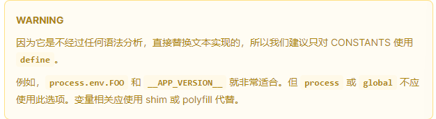
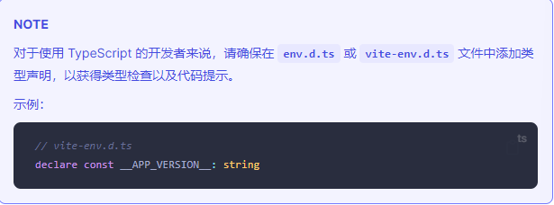
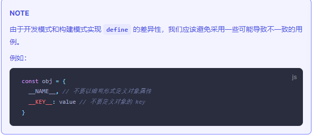

### 共享配置
[共享配置](https://cn.vitejs.dev/config/shared-options.html#root)

***

#### root
* **类型：** string
* **默认：** process.cwd
项目根目录(index.html文件所在的位置)。可以是一个绝对路径，或者一个相对于该配置文件本身的相对路径

***

#### base
* **类型:** string
* **默认:** /
开发或生产环境服务的公共基础路径。合法的值包括以下几种:
* 绝对URL路径名，例如/foo/
* 完整的URL，例如https://foo.com/
* 空字符串 ./(用于嵌入形式的开发)

***

#### mode
* **类型：** string
* **默认：** 'development' 用于开发，'production'用于构建
在配置中指明将会把serve和build时的模式都覆盖掉。也可以通过命令行--mode选项来重现

***

#### define
* **类型：** Record<string,string>
定义全局常量替换方式。其中每项在开发环境下会被定义在全局，而在构建时被静态替换
* 从2.0.0-beta.70开始，string值会以原始表达式形式使用，所以如果定义了一个字符串常量，它需要被显示地打引号（例如使用JSON.stringify)
* 为了与esbuild的行为保持一致，表达式必须为一个JSON对象(null、boolean、number、string、数组或对象)，亦或是一个单独的标识符
* 替换只会在匹配到周围不是其他字母、数字、_或$时执行
<br/>

<br/>

<br/>


***

#### plugins
* **类型：** (plugin | plugin[] | promise< | plugin[]>)[]
需要用到的插件数组。Falsy虚值的插件将被忽略，插件数组将被扁平化。

***

#### publicDir
* **类型：** string | false
* **默认：** "public"
作为静态资源服务的文件夹。该目录中的文件在开发期间在/处提供，并在1构建期间复制到outDir的根目录，并且始终按原样或复制而无需进行转换。该值可以是文件系统的绝对路径，也可以是相对于项目的根目录的相对路径
<br/>
将publicDir设定为false可以关闭此项功能

*** 

#### cacheDir
* **类型：** string
* **默认：** "node_modules/.vite"
存储缓存文件的目录。此目录下会存储预打包的依赖项或vite生产的某些缓存文件使用缓存可以提高性能。如需重新生成缓存文件，你可以使用--force命令行选项或手动删除目录。此选项的值可以是文件的绝对路径，也可以是以项目根目录为基准的相对路径。当没有检测到package.json时则默认为.vite

***

#### envPrefix
* **类型：** string[] | string
* **默认:** VITE_

<p>以envPrefix开头的环境变量会通过import.meta.env暴露在你的客户端源码中（默认以VITE_开头设置的变量才能在客户端通过import.meta.env中看到，envPrefix可以修改以什么开头）</p>
<p><font color="red">注意：envPrefix不应设置为空字符串，这将暴露你所有的环境变量，导致敏感信息的意外泄漏。检测到配置为''时VIte将会抛出错误</font></p>

***

#### css.modules(针对css模块化的设置)
<p>css模块化(.module.css)会将css文件里的类名进行替换，会生成一个映射对象（对象里的key值为我们设置的类型，值为替换后的值）然后会将替换后的内容复制放到style里放到head标签下。同时原css文件会被替换为js脚本默认导出映射对象</p>
<P>css.modules有个值为localsConvention就是为了设置生成的映射对象的key值以驼峰式显示还是中划线显示</P>
<p>scopeBehaviour:配置当前的模块化行为是模块化还是全局化（值为local就是开始模块化）</p>
<p>generateScopedName:生成类名的命名规则</p>

```
export default defineConfig({
  css:{
    modules:{
      localsConvention:'camelCase'
    }
  }
})
```