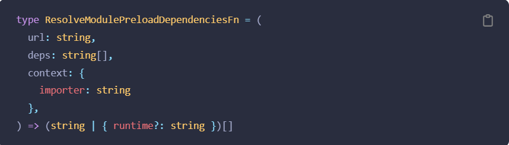
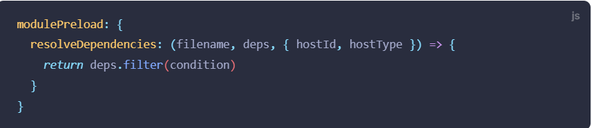

### 构建选项
[构建选项](https://cn.vitejs.dev/config/build-options.html)

***

#### build.targrt
* **类型：** string | string[]
* **默认：** 'modules'
* **相关内容：** [浏览器兼容性](https://cn.vitejs.dev/guide/build.html#browser-compatibility)

设置最终构建的浏览器兼容目标。默认值是一个 Vite 特有的值——'modules'，这是指 支持原生 ES 模块、原生 ESM 动态导入 和 import.meta 的浏览器。

另一个特殊值是 “esnext” —— 即假设有原生动态导入支持，并且将会转译得尽可能小：

* 如果 build.minify 选项为 'terser'，'esnext' 将会强制降级为 'es2019'。
* 其他情况下将完全不会执行转译。
转换过程将会由 esbuild 执行，并且此值应该是一个合法的 esbuild 目标选项。自定义目标也可以是一个 ES 版本（例如：es2015）、一个浏览器版本（例如：chrome58）或是多个目标组成的一个数组。

注意：如果代码包含不能被 esbuild 安全地编译的特性，那么构建将会失败。查看 esbuild 文档 获取更多细节。

***

#### build.modulePreload
* **类型：** boolean | { polyfill?: boolean, resolveDependencies?: ResolveModulePreloadDependenciesFn }
* **默认值：** true

默认情况下，一个 模块预加载 polyfill 会被自动注入。该 polyfill 会自动注入到每个 index.html 入口的的代理模块中。如果构建通过 build.rollupOptions.input 被配置为了使用非 HTML 入口的形式，那么必须要在你的自定义入口中手动引入该 polyfill：

**import 'vite/modulepreload-polyfill'**

注意：此 polyfill 不适用于 Library 模式。如果你需要支持不支持动态引入的浏览器，你应该避免在你的库中使用此选项。

此 polyfill 可以通过 { polyfill: false } 来禁用。

每个动态导入要预加载的块列表将由 Vite 计算。默认情况下，在载入这些依赖时，会使用一个包含 base 的绝对路径。如果 base 是相对路径（'' 或者 './'），解析时则会使用 import.meta.url，以避免出现依赖于最终部署基路径的绝对路径。

目前有一个实验性功能支持使用 resolveDependencies 函数对依赖项列表及其路径进行细粒度控制。它期望接收一个 ResolveModulePreloadDependenciesFn 类型的函数:

resolveDependencies 函数将为每个动态导入调用，同时带着一个它所依赖的 chunk 列表。并且它还会为每个在入口 HTML 文件中导入的 chunk 调用。 可以返回一个新的依赖关系数组，可能被过滤后变少了，也可能有更多依赖注入进来了，同时它们的路径也被修改过。deps 路径是相对于 build.outDir 的。若在注入该模块到 HTML head 时使用 new URL(dep, import.meta.url) 获取绝对路径，则对于 hostType === 'js'，允许返回一个相对于 hostId 的路径。

解析得到的依赖路径可以再在之后使用 experimental.renderBuiltUrl 更改。

***

#### build.polyfillModulePreload
* **类型：** boolean
* **默认：** true

已废弃 请使用 build.modulePreload.polyfill 替代
是否自动注入一个 模块预加载 polyfill。

***

#### build.outDir
* **类型：** string
* **默认：** dist

指定输出路径（相对于 项目根目录).

***

#### build.assetsDir
* **类型：** string
* **默认：** assets

指定生成静态资源的存放路径（相对于 build.outDir）。

***

#### build.assetsInlineLimit
* **类型：** number
* **默认：*** 4096 (4kb)

小于此阈值的导入或引用资源将内联为 base64 编码，以避免额外的 http 请求。设置为 0 可以完全禁用此项。

Git LFS 占位符会自动排除在内联之外，因为它们不包含它们所表示的文件的内容。

注意:

如果你指定了 build.lib，那么 build.assetsInlineLimit 将被忽略，无论文件大小或是否为 Git LFS 占位符，资源都会被内联。

***

#### build.cssCodeSplit
* **类型：** boolean
* **默认：** true
启用/禁用 CSS 代码拆分。当启用时，在异步 chunk 中导入的 CSS 将内联到异步 chunk 本身，并在其被加载时插入。

如果禁用，整个项目中的所有 CSS 将被提取到一个 CSS 文件中。

注意

如果指定了 build.lib，build.cssCodeSplit 会默认为 false。

***

#### build.cssTarget
* **类型：** string | string[]
* **默认值：** 与 [build.target](https://cn.vitejs.dev/config/) 一致

此选项允许用户为 CSS 的压缩设置一个不同的浏览器 target，此处的 target 并非是用于 JavaScript 转写目标。

应只在针对非主流浏览器时使用。 最直观的示例是当你要兼容的场景是安卓微信中的 webview 时，它支持大多数现代的 JavaScript 功能，但并不支持 CSS 中的 #RGBA 十六进制颜色符号。 这种情况下，你需要将 build.cssTarget 设置为 chrome61，以防止 vite 将 rgba() 颜色转化为 #RGBA 十六进制符号的形式。

***

#### build.sourcemap
* **类型：** boolean | 'inline' | 'hidden'
* **默认：** false

构建后是否生成 source map 文件。如果为 true，将会创建一个独立的 source map 文件。如果为 'inline'，source map 将作为一个 data URI 附加在输出文件中。'hidden' 的工作原理与 'true' 相似，只是 bundle 文件中相应的注释将不被保留。

***

#### build.rollupOptions
* **类型：** [RollupOptions](https://rollupjs.org/guide/en/#big-list-of-options)

自定义底层的 Rollup 打包配置。这与从 Rollup 配置文件导出的选项相同，并将与 Vite 的内部 Rollup 选项合并。查看 Rollup 选项文档 获取更多细节。

***

#### build.commonjsOptions
* **类型：** [RollupCommonJSOptions](https://github.com/rollup/plugins/tree/master/packages/commonjs#options)

传递给 @rollup/plugin-commonjs 插件的选项。

***

#### build.dynamicImportVarsOptions
* **类型：** RollupDynamicImportVarsOptions
相关内容： [动态导入](https://cn.vitejs.dev/guide/features.html#dynamic-import)

传递给 @rollup/plugin-dynamic-import-vars 的选项。

***

#### build.lib
* **类型：** { entry: string | string[] | { [entryAlias: string]: string }, name?: string, formats?: ('es' | 'cjs' | 'umd' | 'iife')[], fileName?: string | ((format: ModuleFormat, entryName: string) => string) }
* **相关内容：** [库模式](https://cn.vitejs.dev/guide/build.html#library-mode)

构建为库。entry 是必需的，因为库不能使用 HTML 作为入口。name 则是暴露的全局变量，并且在 formats 包含 'umd' 或 'iife' 时是必需的。默认 formats 是 ['es', 'umd']，如果使用了多个配置入口，则是 ['es', 'cjs']。fileName 是输出的包文件名，默认 fileName 是 package.json 的 name 选项，同时，它还可以被定义为参数为 format 和 entryAlias 的函数。

***

#### build.manifest
* **类型：** boolean | string
* **默认：** false
* **相关内容：** [后端集成](https://cn.vitejs.dev/guide/backend-integration.html)

当设置为 true，构建后将会生成 manifest.json 文件，包含了没有被 hash 过的资源文件名和 hash 后版本的映射。可以为一些服务器框架渲染时提供正确的资源引入链接。当该值为一个字符串时，它将作为 manifest 文件的名字。

***

#### build.ssrManifest
* **类型：** boolean | string
* **默认值：** false
* **相关链接：** [服务端渲染](https://cn.vitejs.dev/guide/ssr.html)

当设置为 true 时，构建也将生成 SSR 的 manifest 文件，以确定生产中的样式链接与资产预加载指令。当该值为一个字符串时，它将作为 manifest 文件的名字。

***

#### build.ssr
* **类型：** boolean | string
* **默认值：**  undefined
* **相关链接：** [Server-Side Rendering](https://cn.vitejs.dev/guide/ssr.html)

生成面向 SSR 的构建。此选项的值可以是字符串，用于直接定义 SSR 的入口，也可以为 true，但这需要通过设置 rollupOptions.input 来指定 SSR 的入口。

***

#### build.minify
* **类型：** boolean | 'terser' | 'esbuild'
* **默认：** 'esbuild'

设置为 false 可以禁用最小化混淆，或是用来指定使用哪种混淆器。默认为 Esbuild，它比 terser 快 20-40 倍，压缩率只差 1%-2%。Benchmarks

注意，在 lib 模式下使用 'es' 时，build.minify 选项不会缩减空格，因为会移除掉 pure 标注，导致破坏 tree-shaking。

当设置为 'terser' 时必须先安装 Terser。

**npm add -D terser**

***

#### build.terserOptions
* **类型：**  TerserOptions

传递给 Terser 的更多 minify 选项。

***

#### build.write
* **类型：**  boolean
* **默认：** true
设置为 false 来禁用将构建后的文件写入磁盘。这常用于 编程式地调用 build() 在写入磁盘之前，需要对构建后的文件进行进一步处理。

***

#### build.emptyOutDir
* **类型：**  boolean
* **默认：**  若 outDir 在 root 目录下，则为 true

默认情况下，若 outDir 在 root 目录下，则 Vite 会在构建时清空该目录。若 outDir 在根目录之外则会抛出一个警告避免意外删除掉重要的文件。可以设置该选项来关闭这个警告。该功能也可以通过命令行参数 --emptyOutDir 来使用。

***

#### build.copyPublicDir
* **实验性特性**
* **类型：**  boolean
* **默认：**  true

默认情况下，Vite 会在构建阶段将 publicDir 目录中的所有文件复制到 outDir 目录中。可以通过设置该选项为 false 来禁用该行为。

***

#### build.reportCompressedSize
* **类型：**  boolean
* **默认：**  true
启用/禁用 gzip 压缩大小报告。压缩大型输出文件可能会很慢，因此禁用该功能可能会提高大型项目的构建性能。

***

#### build.chunkSizeWarningLimit
* **类型：**  number
* **默认：** 500
规定触发警告的 chunk 大小。（以 kbs 为单位）

***

#### build.watch
* **类型：**  WatcherOptions| null
* **默认：**  null
设置为 {} 则会启用 rollup 的监听器。对于只在构建阶段或者集成流程使用的插件很常用。

在 Windows Linux 子系统（WSL）上使用 Vite

某些情况下 WSL2 的文件系统监听可能无法正常工作。 查看 server.watch 了解更多细节。
